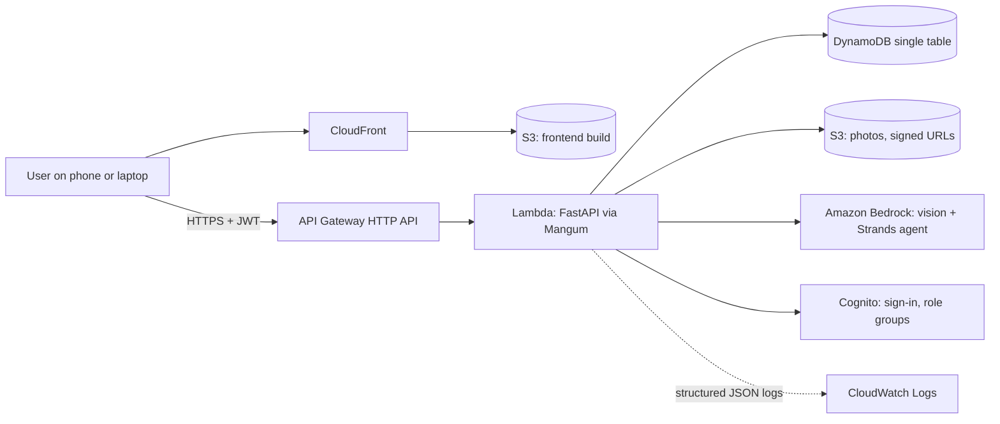
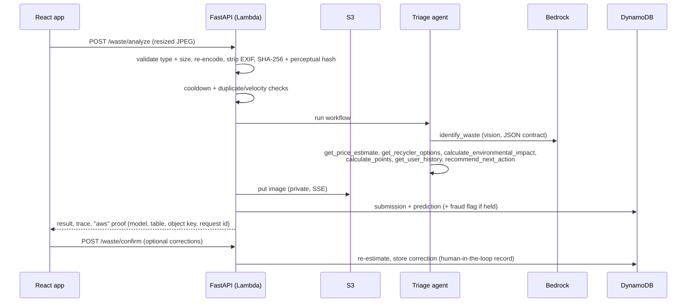
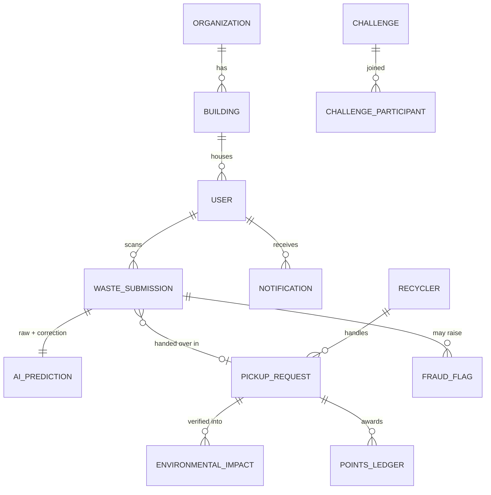
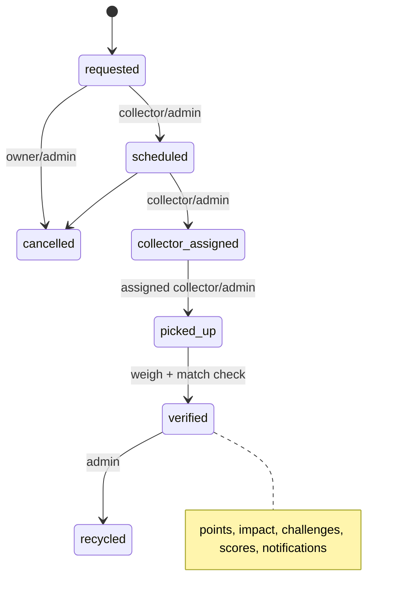

# Architecture

## System

Locally the same FastAPI app runs under uvicorn; `Store`, `ImageStorage`, `AIProvider`, `AuthProvider` swap to in-memory, disk, mock and dev-JWT. Selection is automatic: a layer uses AWS when its resource is configured (or when running in Lambda for AI); otherwise it stays local.

### Why one Python backend (FastAPI + Mangum)
Fastest to build and test, one language for business logic, and the local demo is the production code path. The cost: a Lambda cold start (the zip is ~142 MB unzipped with the Strands SDK; limit is 250 MB), the 29 s API Gateway limit, and a 6 MB payload limit (hence the 4 MB upload cap and client-side image resize).

### Why no SQS / EventBridge
Analysis takes seconds and fits in one request; nothing subscribes to events yet. The design keeps a seam for them (state changes are explicit service calls, notifications go through a `Channel` interface) but adds no unused services.

## Authentication
- **Dev provider:** scrypt password hashes, HS256 JWT. Refuses to start outside local/test with the default secret.
- **Cognito provider:** the API calls `InitiateAuth` (USER_PASSWORD_AUTH), verifies the ID token against the pool's JWKS (RS256, audience, issuer, `token_use`), maps `cognito:groups` to a role (`ADMIN > ORGANIZATION_ADMIN > COLLECTOR > USER`), and links the token to a user document by email (falling back to `AdminGetUser` if the token has no email claim). Sign-up uses `AdminCreateUser` + permanent password + group.
- Roles: `USER`, `COLLECTOR`, `ADMIN`, `ORGANIZATION_ADMIN`, enforced by a FastAPI dependency on every protected route.

## AI flow (scan)

**Agent.** Seven tools are plain Python functions with typed signatures and docstrings. With Bedrock, a Strands `Agent` (BedrockModel, `callback_handler=None`) receives them as tools and a system prompt requiring tool use and forbidding invented numbers. After the run, any tool the model skipped (or called with drifting arguments) is run deterministically, so the result is always complete and tool-derived. Without Bedrock, or if the agent fails, the same tools run in a fixed order. Each call is recorded in a trace shown to the user. The model's text is kept only as a two-sentence rationale.

**Failure behaviour.** Bedrock error or unusable output → `AIUnavailable`. Demo mode: fall back to the mock and say so. Otherwise: the item is chosen manually and the same enrichment tools still run.

**Advisor.** An intent router (what to do, worth, where, pickup vs drop-off, building/campus improvement, focus category, my impact) builds **verified facts** from the ledger, impact records, ReLoop Score and recycler directory. When Bedrock is available it writes the recommendation from those facts under a "never invent numbers" prompt; otherwise rules write it. The UI always separates *Verified data (with sources)* from *AI-generated recommendation*.

## Data model

Stored as one DynamoDB table (`pk` = entity kind, `sk` = time-sortable id, `gsi1` = per-user listing). Kinds: `users`, `organizations`, `buildings`, `waste_submissions` (waste items embedded), `ai_predictions`, `recyclers`, `pickup_requests`, `points_ledger`, `environmental_impact`, `challenges`, `challenge_participants`, `notifications`, `fraud_flags`, `audit_logs`, plus `bin_scans`, `email_index`, `image_hashes`. **Leaderboards and price estimates are computed views**, not tables. There is no `transactions` table: the points ledger is the transaction record.

Single table is fine at hackathon scale; at production scale, split hot kinds, add GSIs for time ranges, and materialise leaderboards (DynamoDB Streams → Lambda).

## Pickup flow

Drop-off mode is `requested → verified → recycled` with a short code. **Verification** is the single moment that: writes impact rows (collector-weighed weight overrides the estimate), computes points (held if the submission has an open fraud flag; capped per day), moves challenge progress (and pays completion rewards), recomputes rank, tier and building score, and sends notifications. It is guarded against double-awarding by the state machine.

## Formulas (all parameters in `backend/app/data/assumptions/`)
**Points** = base × weight factor × recovery factor × quantity, **+ 20 % verified**, **+ 5 % segregation** (verifier confirms the item matched), **+ 10 % per joined matching challenge (cap 25 %)**; rounded. Weight factor = clamp(0.6 + 0.4 × weight/typical, 0.6, 2.0); recovery factor = 0.75 + recovery score/200. All bonuses are percentages of the base, so splitting items gains nothing. Daily cap: 600. Example: a verified 1.8 kg laptop = 126 × 1.00 × 1.14 = 143.6 → +28.7 +7.2 = **180**. Joined to E-Waste Week: **194**. Base points are design parameters anchored so a verified laptop is 180.

**Impact** (illustrative, per item): weight = typical or measured; CO₂e = factor × quantity × clamp(weight/typical, 0.3, 3); recoverable material per type = weight × share × recovery score. Factors in `impact_factors.yaml` are **placeholders** to replace with cited values.

**ReLoop Score (0–100)** = 30 × participation + 25 × verified disposal + 20 × waste diverted + 15 × segregation quality + 10 × consistency, each 0–1, over 30 days. Participation = active members ÷ enrolled members (full marks at 50 %); verified disposal = verified ÷ committed items; diverted = kg ÷ target (3 kg per enrolled member); segregation = average cleanliness of confirmed bin checks; consistency = weeks with activity out of the last 4. The UI shows every component with its detail and the formula.

**Gap analysis** compares the share of items collected per category (90 days) to a configured expected mix and sizes a collection drive from configured participation assumptions. It is labeled as an estimate.

## Fraud and abuse controls
SHA-256 exact duplicates and 64-bit perceptual hash near-duplicates, per-user cooldown, hourly velocity limit, suspicion score → `pending_review` → open flag in the admin queue; awards for flagged items are **held** and released or voided by an admin; verification-required rewards; daily cap; admin points adjustments are ledger rows with an audit entry; verifier mismatch removes the bonus and raises a flag.

## Observability
Structured JSON log lines (`event`, ids, status, latency; secrets redacted by key) for startup, requests, submissions, pickup transitions, audits, AI outages and agent fallbacks. In Lambda they land in the function's CloudWatch log group (14-day retention); filter with Logs Insights on `event`.

## Scaling notes
Lambda scales out per request; DynamoDB is on-demand. Pressure points: reading whole kinds for leaderboards/scores, single partition per kind, 29 s synchronous AI call (move to SQS + status polling if you add slower models), in-process rate limiting.
